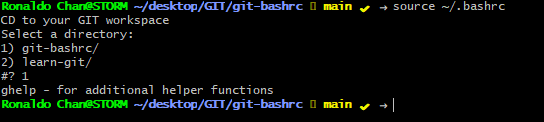

## git-bashrc

It's a survival wrapper toolkit for git to get around the complex git commands ! this was written specifically for git bash but can also be used in a real linux shell

To use just copy this file to your home directory and rename the file to .bashrc and use source ~/.bashrc to take effect or re-open git bash

Note: Please go to end of the line and replace REPO variable to reflect your main repository folder such as $HOME/desktop/myGIT/

# Installation

cp git-completion.bash ~/.git-completion.bash 
cp bashrc ~/.bashrc 
cp vimrc ~/.vimrc # optional  
source ~/.bashrc

